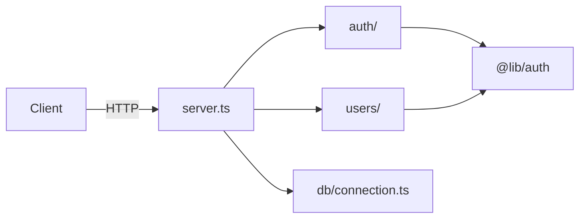

# generate-parent-page

Use this skill to generate one parent folder's wiki page. A parent folder is a source folder that has at least one direct child folder containing wikifiable content. The page must do three jobs:

1. **Loose-files synthesis** — describe the folder's own (non-subdirectory) source files, if any.
2. **Children synthesis** — narratively summarize what each child sub-module's wiki contains and how the children relate to each other.
3. **Overall-role synthesis** — combine 1 and 2 into a coherent statement of what this folder is in the larger system.

The output is one page (`index.md`) with all three syntheses woven together.

## When to use

A parent folder needs (re)generation. **Do not invoke this skill for leaf folders** (use `generate-leaf-page` instead).

A parent folder is a folder whose `is_leaf` field from `bin/walk-tree.py` is `False`: it has at least one surviving child directory.

**Critical ordering**: this skill must be invoked **after** all of the folder's direct children have already had their wikis (re)generated. Otherwise the children-synthesis step reads stale content and produces an inconsistent page. The caller (build/sync/rebuild) is responsible for ordering — but if you're invoked and a child wiki path doesn't exist, stop and report it.

## Inputs (passed by the caller)

```
{
  "folder_abs": "/abs/path/to/source-root/parent",
  "folder_relpath": "parent",                      // relative to project root
  "source_root": "src",                            // configured source root
  "loose_files": ["index.ts", "config.ts"],       // basenames of non-ignored files directly in folder; may be []
  "child_wiki_paths": [                            // wiki paths of direct children; relative to project root
    "wiki/src/parent/auth/index.md",
    "wiki/src/parent/users/index.md"
  ],
  "target_wiki_relpath": "wiki/src/parent/index.md",
  "wiki_language": "en",
  "language_hints": ["typescript"]
}
```

If `child_wiki_paths` is empty, the folder is not a parent — abort and tell the caller (it should have used `generate-leaf-page`).

## Process

### Step 1: Loose-files synthesis

If `loose_files` is empty, skip this step and note that the page will have no "Loose files" section.

Otherwise, read each loose file and produce a focused mini-synthesis covering:
- What each loose file is responsible for (one short sentence).
- How the loose files collectively contribute to the parent's role (one paragraph).

Treat this as a mini leaf-page synthesis but more compact — no Concepts/Notes sections, just descriptions.

### Step 2: Children synthesis

For each path in `child_wiki_paths`, read the child's `index.md`. Use only the page's prose — do not re-read the underlying source code (that's the child wiki's job).

Produce a narrative paragraph **per child** (not a one-liner) covering:
- What the child folder contains (its responsibility, key abstractions).
- How it differs from its sibling children.
- Any cross-references the child makes back into the parent's domain.

The combined output is a section of prose paragraphs that reads as a coherent description of the children, not a flat list of summaries.

If any child wiki is missing or fails to read, abort: the caller invoked this skill at the wrong time.

### Step 3: Overall-role synthesis

Now combine outputs of Step 1 and Step 2 into a single paragraph (or 2–3 paragraphs for larger modules) that answers:

- **What is this folder, in one sentence?**
- **How do the children + loose files fit together to make this folder do its job?**
- **What is the boundary between this folder and its peers/parent?**

This becomes the page's `## Overview` section. It is the most-read part of the page; spend effort here.

### Step 4: Decide on a Mermaid diagram

Include a `mermaid` block under `## Architecture` **only when** prose alone is insufficient to convey the structure — typically when there are 3+ sub-modules with non-trivial relationships (data flow, dependency direction, layering).

Skip the diagram (and use prose only) when:
- The parent has only 1–2 children.
- The relationships are obvious (e.g. "components/" + "pages/" — pages use components; no diagram needed).
- The diagram would just restate what the prose already says.

If you do include a diagram, it should add information that prose cannot. Quality over visual flair.

### Step 5: Produce the page

Match the structure of `templates/page-parent.md`:

```markdown
# <folder name>

## Overview

<Step 3 output: 1–3 paragraph overall role synthesis>

## Sub-modules

<Step 2 output: narrative paragraphs per child>

- [<child>](./child/index.md) — <one-line index — derived from your prose>
- ...

## Loose files

<Only if loose_files is non-empty.>

<Step 1 output: brief synthesis paragraph>

- [`<file>`](relative/path) — <one-line description>

## Architecture

<How sub-modules and loose files interact: data flow, layering. Include a mermaid diagram only if Step 4 said yes.>

## Related Topics

<Links to topic pages, if any are relevant. Skip this section if none exist.>
```

The H1 is the folder's basename. The bulleted list under "Sub-modules" is for navigation; the prose above it is for understanding — both must be present.

### Step 6: Write the file

Use the `Write` tool to write the produced markdown to `target_wiki_relpath`.

## Output format requirements

- **Language**: match `wiki_language`.
- **Length**: 50–200 lines is typical. Tighter is better at the parent level — a sprawling parent page often signals a missing topic page (cross-cutting concern that should live in `wiki/topics/`).
- **Children synthesis depth**: each child gets a meaningful paragraph; 1–4 sentences. Don't pad short children to look balanced.
- **Loose files section**: omit entirely if `loose_files` is empty.
- **Architecture section**: include even without a diagram if the prose adds meaningful information; skip if the diagram would have been the only content.
- **Related Topics**: skip the section if there are no relevant topic pages.

## Computing source links

The "Loose files" bullet list links to actual source files — compute via `bin/lib/wiki_path.py:relative_link()` from `target_wiki_relpath` to `<folder_relpath>/<filename>`. The caller may pre-compute these for you.

## Examples

### Bad parent page (anti-pattern)

```markdown
# api

This folder is the API folder.

## Sub-modules

- [auth](./auth/index.md) — auth folder
- [users](./users/index.md) — users folder

## Loose files
- `server.ts` — server file

## Architecture

The folders work together.
```

Why bad: every sentence is a tautology. The page provides no information beyond what the link list itself says.

### Good parent page

```markdown
# api

## Overview

The API server's request-handling layer. `server.ts` boots the server and
mounts route handlers from the two sub-modules: [`auth/`](./auth/index.md)
issues and validates session tokens; [`users/`](./users/index.md) reads user
profiles. Both depend on [`@lib/auth`](../../packages/lib/index.md) for the
underlying token primitives — this folder owns the HTTP boundary, the lib
owns the cryptography.

## Sub-modules

The [`auth/`](./auth/index.md) sub-module exposes `POST /login` and
`POST /logout`. Login accepts a username/password pair and returns an opaque
token signed via `@lib/auth.signToken`; logout requires a valid Bearer token
and is a no-op (token revocation is not implemented).

The [`users/`](./users/index.md) sub-module currently exposes only
`GET /users/me`, which decodes the request's Bearer token via
`@lib/auth.validateToken` and returns the `sub` claim.

- [auth/](./auth/index.md) — login/logout HTTP routes
- [users/](./users/index.md) — current-user lookup

## Loose files

`server.ts` is the boot entry point. It awaits the database connection, then
mounts both route maps and prints the listen address. Route registration is a
plain object merge, not a router framework.

- [`server.ts`](../../../apps/api/src/server.ts) — server bootstrap

## Architecture



The HTTP boundary is `server.ts`; `auth/` and `users/` each return route maps that get merged at boot. Both sub-modules call into `@lib/auth` (in `packages/lib/`) for token operations — this folder does not duplicate cryptographic logic.
```

Why good: prose describes what the folder is *for*, every claim is anchored, the diagram adds the cross-folder dependency on `@lib/auth` that the prose mentions but doesn't visually convey, sub-module paragraphs are substantive without being padded.

## Failure modes — surface, don't paper over

- Child wiki missing or unreadable → abort. Caller is responsible for ordering.
- Two children with identical names (shouldn't happen on a real filesystem, but defensive check) → abort.
- A child wiki is so empty (e.g. just a stub heading) that there's nothing to synthesize → note in your paragraph: "[`X`](./X/index.md) — generation produced a minimal page; see source for details."
- Loose files genuinely have unrelated purposes (rare but possible) → list each separately rather than fabricate a unifying narrative.
